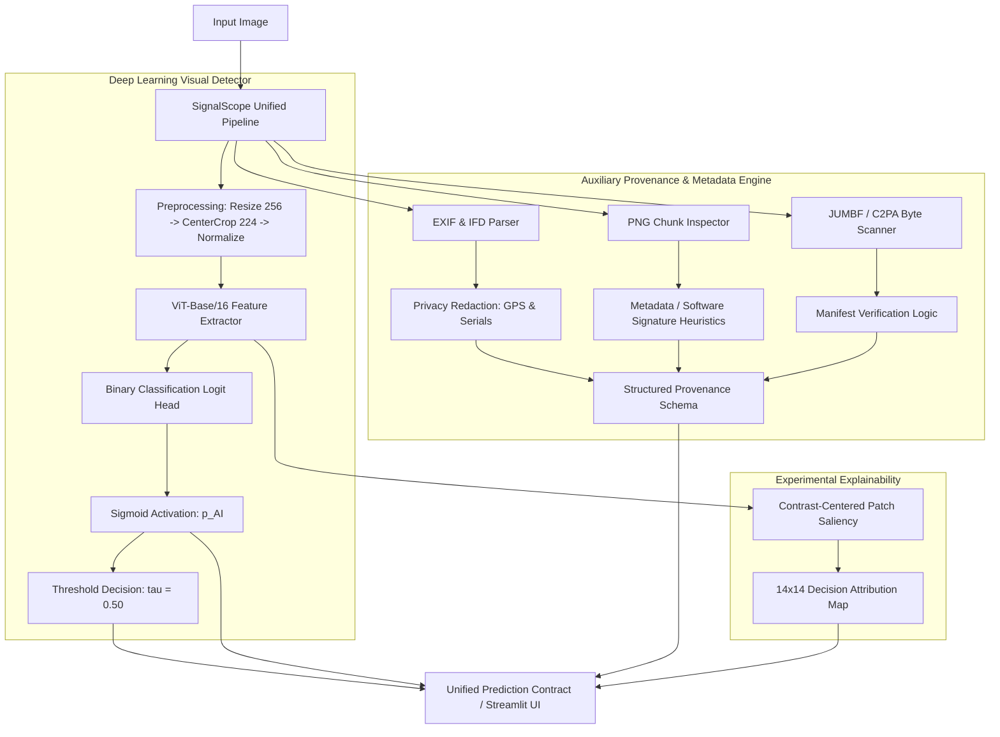

# SignalScope — Generative Media Forensics

**Smart India Hackathon 2026** | **Software Edition** | **Team Priyansh Saxena**

---

## 1. Overview

**SignalScope** is an artificial intelligence detection and media forensics system engineered to classify images as Real or AI-generated. In response to the rapid proliferation of diffusion models and generative adversarial networks (GANs), SignalScope pairs a deep learning visual classifier with transparent confidence estimation, auxiliary container provenance inspection, and an empirical evaluation framework.

---

## 2. Problem Statement

The Smart India Hackathon problem statement asks participants to build an effective detector capable of:
1. **Binary Classification**: Reliably predicting whether an input image is **Real** or **AI-generated**.
2. **Confidence & Probability Reporting**: Outputting continuous AI probability scores ($p_{\text{AI}} \in [0, 1]$) alongside human-interpretable confidence ratings.
3. **Generalization to Unseen Generators**: Retaining predictive power when encountering generative architectures not present in the training cohort.
4. **Transparent Explanations & Forensics**: Providing grounded, interpretable cues and metadata analysis without fabricating evidence or overclaiming model certainty.

---

## 3. Current Capabilities

| Capability | Status | Implementation Details |
| :--- | :---: | :--- |
| **Real vs. AI Binary Classification** | **Implemented** | ViT-Base/16 architecture classifying at a fixed threshold ($\tau = 0.50$). |
| **Continuous Probability & Confidence** | **Implemented** | Raw scalar logits mapped via sigmoid to $p_{\text{AI}}$, providing low/medium/high confidence bands. |
| **EXIF Metadata & Hardware Analysis** | **Implemented** | Extracts Make, Model, Lens, DateTime, and exposure settings via Pillow. |
| **Geospatial & Serial Privacy Safeguards** | **Implemented** | Server-side redaction of GPS tags (`gps_redacted=True`) and camera serial numbers (`****-XXXX`). |
| **AI Software Pattern Detection** | **Implemented** | Inspects PNG metadata chunks (`parameters`, `workflow`) and EXIF Software headers for known generators. |
| **C2PA / JUMBF Container Detection** | **Implemented** | Pure-Python byte scanner for ISO/IEC 19566-5 JUMBF boxes and C2PA Content Credentials UUIDs. |
| **Interactive Streamlit Web Interface** | **Implemented** | 3-tab layout: Image Inspection, Degradation Playground, and Evaluation Report. |
| **Automated Test Suite** | **Implemented** | Automated tests covering model, inference, evaluation, robustness, provenance, and contracts. |
| **Experimental Patch Decision Saliency** | **Experimental** | 14×14 grid relative patch attribution on the final LayerNorm of ViT; **not** an authoritative forgery mask. |
| **Robustness Evaluation Framework** | **Framework Implemented** | Controlled 15-condition degradation pipeline; **empirical 5,600-image benchmark pending GPU run**. |
| **Official Held-Out Benchmark Evaluator** | **Evaluator Implemented** | Strict read-only discovery and metric evaluation script; **official 100k inference pending GPU run**. |
| **Generator Family Attribution** | **Not Implemented** | Current binary classifier reports `"Undetermined"`; attribution is not claimed from weak cues. |

---

## 4. Architecture



---

## 5. Model Specifications

- **Backbone Architecture**: Vision Transformer Base (`vit_base_patch16_224` via `timm`).
- **Total Parameters**: 85.8 Million (all parameters loaded in evaluation mode).
- **Classification Head**: Linear projection layer mapping 768-dimensional CLS token embeddings to a single scalar logit ($z \in \mathbb{R}$).
- **Activation & Output**: Sigmoid mapping $\sigma(z) \to p_{\text{AI}} \in [0.0, 1.0]$.
- **Label Mapping**:
  - `0` = Real
  - `1` = AI-generated
- **Decision Boundary**: Fixed at threshold $\tau = 0.50$ (`is_ai = bool(p_ai >= 0.50)`).
- **Evaluation Preprocessing**: Deterministic pipeline using standard ImageNet normalization statistics:
  $$\text{Resize}(256) \longrightarrow \text{CenterCrop}(224) \longrightarrow \text{ToTensor}() \longrightarrow \text{Normalize}(\mu, \sigma)$$
  - Mean: $[0.485, 0.456, 0.406]$
  - Std: $[0.229, 0.224, 0.225]$
- **Training Configuration**: Trained on the Tiny-GenImage development dataset using AdamW optimizer (`learning_rate = 1e-4`, `weight_decay = 0.01`), cosine learning rate decay, and data augmentations (random Gaussian blur, random JPEG compression simulation, and random horizontal flip).

---

## 6. Development Validation Results

> [!NOTE]
> The metrics below represent evaluation on the **development validation partition** of Tiny-GenImage (7,000 images: 3,500 Real + 3,500 AI-generated). They are **NOT** the official held-out benchmark results.

### Aggregate Validation Performance
- **Validation Sample Count**: 7,000 images
- **Overall ROC-AUC**: **0.8562**
- **Macro-F1 Score ($\tau = 0.50$)**: **0.7834**
- **Accuracy ($\tau = 0.50$)**: **78.34%**
- **False Positive Rate (FPR)**: **21.86%**
- **Precision**: **0.7823**
- **Recall (TPR)**: **0.7854**

### Validation Confusion Matrix
| | Predicted: Real | Predicted: AI-generated |
| :--- | :---: | :---: |
| **Actual: Real** | **TN = 2,735** | **FP = 765** |
| **Actual: AI-generated** | **FN = 751** | **TP = 2,749** |

### Per-Generator Area Under ROC Curve (Development Split)
| Generative Family / Model | Validation ROC-AUC |
| :--- | :---: |
| **ADM** | 0.6026 |
| **VQDM** | 0.7656 |
| **Midjourney** | 0.8740 |
| **GLIDE** | 0.9217 |
| **BigGAN** | 0.9346 |
| **Stable Diffusion v1.5 (SD15)** | 0.9437 |
| **Wukong** | 0.9513 |

### Post-Hoc Probability Calibration (Temperature Scaling)
SignalScope employs formal **post-hoc temperature scaling** to calibrate prediction probabilities without altering model weights or decision boundaries:
- **Fitting Dataset**: Fitted exclusively on the 7,000-image **development validation partition** (3,500 Real + 3,500 AI-generated).
- **Benchmark Isolation**: The official 100k held-out benchmark was **NOT** used or accessed for calibration.
- **Weights & Threshold Invariance**: Backbone weights and the fixed $\tau = 0.50$ operating decision threshold remain completely unmodified.
- **Mathematical Formula**: Calibrated continuous probability is computed as $p_{\text{AI}} = \sigma(z / T)$ on raw logit $z$ with scalar temperature $T > 0$.
- **Optimal Temperature**: **$T = 1.9591$** (optimized via Negative Log-Likelihood minimization).
- **Calibration Artifact**: Stored with audit metadata in [`model/weights/temperature.json`](model/weights/temperature.json).

| Metric | Before Calibration ($T = 1.0$) | After Calibration ($T = 1.9591$) | Improvement / Change |
| :--- | :---: | :---: | :---: |
| **Negative Log-Likelihood (NLL)** | 0.5442 | **0.4726** | **-0.0716** (13.2% relative reduction) |
| **Brier Score (MSE)** | 0.1608 | **0.1533** | **-0.0075** (4.7% improvement) |
| **Expected Calibration Error (ECE)** | 0.0845 | **0.0238** | **-0.0607** (71.8% error reduction) |
| **Maximum Calibration Error (MCE)** | 0.1770 | **0.0569** | **-0.1201** (67.9% reduction) |
| **Decision Threshold ($\tau$)** | 0.50 | 0.50 | *Strictly unchanged* |
| **ROC-AUC / Accuracy** | 0.8562 / 78.34% | 0.8562 / 78.34% | *Strictly rank-invariant* |

> [!NOTE]
> Post-hoc calibrated probability scores ($p_{\text{AI}}$) provide well-calibrated statistical likelihoods that align observed empirical accuracy with model confidence, but remain probabilistic estimations rather than legal proof of AI generation.

---

## 7. Official Held-Out Benchmark

The official held-out benchmark evaluation evaluates generalization on an unseen test dataset.

### Benchmark Parameters
- **Cohort Size**: 100,000 images (strictly balanced: 50,000 Real, 50,000 AI-generated).
- **Generators Represented**: ADM, BigGAN, GLIDE, Midjourney, Stable Diffusion v1.4, Stable Diffusion v1.5, VQDM, and Wukong.
- **Data Isolation**: The benchmark directory is held strictly read-only; no training, tuning, or caching touches this data.
- **Execution Status**: The benchmark evaluation runner ([`model/evaluate_held_out.py`](model/evaluate_held_out.py)) is implemented and validated. The official 100,000-image inference run is **currently pending GPU execution** due to local CPU throughput constraints. Official ROC-AUC and confusion metrics will be updated upon completion.

---

## 8. Robustness Evaluation Framework

SignalScope implements a controlled robustness framework ([`src/evaluation/robustness.py`](src/evaluation/robustness.py)) to assess detector resilience against social distribution degradations without threshold retuning.

### Evaluated Conditions (16 Total)
1. **Clean Baseline**: Unmodified original source image.
2. **JPEG Recompression**: Quality factors $Q \in \{95, 75, 50, 30\}$.
3. **Bilinear Downscaling & Restoration**: Scales $s \in \{0.75, 0.50, 0.25\}$, bilinearly restored to native resolution.
4. **Gaussian Blur**: Kernel standard deviations $\sigma \in \{0.5, 1.0, 2.0\}$ pixels.
5. **Screenshot-Like Compound Proxy**: Multi-stage degradation (downscale to $70\% \to$ restore $\to$ JPEG $Q=80$).  
   *(Explicitly designated as a controlled proxy; does not claim exact equivalence to proprietary platform transcoding).*
6. **Light Photometric Edits**: Brightness adjustments ($\times 1.15$, $\times 0.85$) and Contrast adjustments ($\times 1.15$, $\times 0.85$).

### Execution Status
The evaluation framework uses a deterministic, stratified sample of 350 validation images (175 Real, 175 AI with 25 each from 7 generator families) across 16 conditions (5,600 total inferences). Full empirical results are **pending execution** on GPU compute.

---

## 9. Provenance & Metadata Engine

SignalScope includes an auxiliary forensic engine ([`src/provenance/`](src/provenance/)) designed to extract corroborative context while upholding strict forensic and privacy principles:

- **Non-Authoritative Signal**: Provenance metadata **never** alters the detector logit, $p_{\text{AI}}$, verdict, or threshold.
- **Forensic Boundaries**:
  - Missing EXIF does **not** prove an image is AI-generated (routine social media pipelines strip headers).
  - Present camera EXIF does **not** prove authenticity (headers can be spoofed trivially).
  - Absence of C2PA credentials does **not** prove an image is synthetic.
- **Privacy Protections**:
  - `GPSInfo` coordinates are stripped; the system sets `"gps_redacted": true`.
  - Camera and lens serial numbers are masked to the last 4 characters (e.g., `****-7465`).
- **C2PA / JUMBF Verification Semantics**:
  - `VALID_C2PA`: Reserved **only** for successful cryptographic signature verification via active PKI trust anchors.
  - `UNVERIFIED_MANIFEST`: Assigned when a C2PA container or JUMBF structure is detected in the byte stream, but cryptographic chain verification was not performed.
  - `NOT_PRESENT`: No C2PA or JUMBF markers detected.

---

## 10. Experimental Explainability: Patch Decision Saliency

SignalScope includes an experimental visual explainability module ([`model/explain.py`](model/explain.py)):
- **Mechanism**: Extracts activations and gradients from `model.blocks[-1].norm1` on the 196 spatial patch tokens ($14 \times 14$ grid), applying spatial contrast centering and bilinear upsampling to $224 \times 224$.
- **Interpretation**: Illustrates which image regions contributed above average toward the model's positive AI logit.
- **Limitations & Disclaimers**:
  - This is an experimental decision-attribution visualizer, **not** an authoritative forensic tamper or manipulation mask.
  - It does not pinpoint pixel-level forgeries or explain why an image is classified as real.
  - Empirical faithfulness checks on ViT representations showed mixed localization precision; results must be treated as indicative only.

---

## 11. Streamlit Web Interface

The interactive dashboard ([`src/ui/app.py`](src/ui/app.py)) provides three functional views:
1. **Image Inspection (Tab 1)**: Allows user image upload, runs prediction, renders continuous probability and confidence badges, displays source metadata and C2PA status, and provides an optional toggle for patch decision saliency.
2. **Robustness Playground (Tab 2)**: Interactive sliders for JPEG compression, Gaussian blur, and downscaling to test detector resilience and display real-time probability shift deltas.
3. **Evaluation & Model Report (Tab 3)**: Summarizes development validation metrics, per-generator performance tables, and held-out benchmark placeholders.

---

## 12. Repository Structure

```
SignalScope/
├── configs/
│   └── train_config.yaml         # Training and experiment hyperparameter configuration
├── model/
│   ├── backbone.py               # Vision classifier and swappable model architectures
│   ├── calibrate.py              # Post-hoc temperature scaling calibration engine & runner
│   ├── evaluate_held_out.py      # Official 100k held-out benchmark evaluator
│   ├── evaluate_robustness.py    # 15-condition empirical robustness benchmark runner
│   ├── explain.py                # Experimental ViT contrast-centered patch saliency
│   ├── predict.py                # Standardized CLI and programmatic inference interface
│   ├── train.py                  # Training pipeline with mixed-precision and validation
│   └── weights/
│       ├── checkpoint_best.pth   # Frozen ViT-Base/16 production weights (untracked in git)
│       └── temperature.json      # Post-hoc temperature calibration parameters
├── report/
│   ├── provenance_metadata.md    # Stage 13 Provenance & Metadata forensic report
│   └── robustness_evaluation.md  # Stage 12 Robustness framework report
├── src/
│   ├── data/
│   │   ├── parquet_dataset.py    # Lazy DuckDB reader for Tiny-GenImage Parquet shards
│   │   ├── path_safety.py        # Path isolation guards preventing test-set contamination
│   │   └── transforms.py         # Data augmentation and deterministic evaluation transforms
│   ├── evaluation/
│   │   ├── evaluate.py           # Core metric calculations (AUC, F1, FPR, confusion matrix, ECE)
│   │   └── robustness.py         # In-memory degradation transforms and metrics
│   ├── provenance/
│   │   ├── analyzer.py           # Top-level provenance orchestrator and schema builder
│   │   ├── c2pa.py               # Pure-Python ISO/IEC 19566-5 JUMBF/C2PA container scanner
│   │   └── exif.py               # EXIF parser, GPS/serial redactor, and PNG chunk inspector
│   └── ui/
│       └── app.py                # Streamlit interactive forensic dashboard
├── tests/
│   ├── test_calibration.py       # Unit & contract tests for temperature scaling & metrics
│   ├── test_explain.py           # Unit tests for patch saliency and hook cleanup
│   ├── test_model_and_eval.py    # Backbone forward passes, metrics, and trainer tests
│   ├── test_predict_contract.py  # Prediction contract, schema, and CLI tests
│   ├── test_provenance.py        # 19 provenance, EXIF, C2PA, and privacy tests
│   ├── test_robustness.py        # 11 robustness transformation and invariance tests
│   └── test_test_isolation.py   # Test-set isolation and leakage-prevention tests
├── requirements.txt              # Pinned Python package dependencies
├── run_demo.bat                  # 1-click Windows CLI execution script
├── run_demo.sh                   # 1-click Unix CLI execution script
└── README.md                     # Production repository documentation
```

---

## 13. Setup & Execution Guide

### Prerequisites
- **Operating System**: Windows 10/11, Ubuntu 20.04+, or macOS
- **Python**: Recommended version `3.11` (tested with 3.11 and 3.12)

### 1. Environment Setup
```bash
# Clone repository
git clone https://github.com/Priyansh-Saxena-012/SignalScope-TechSetu.git
cd SignalScope-TechSetu

# Create virtual environment
python -m venv .venv

# Activate virtual environment
# Windows (PowerShell):
.venv\Scripts\Activate.ps1
# Linux / macOS:
source .venv/bin/activate

# Install dependencies
pip install -r requirements.txt
```

### 2. Running Inference via CLI
```bash
# Using explicit weights (or relies on model/weights/checkpoint_best.pth if present)
python model/predict.py --image path/to/image.jpg --json
```

### 3. Launching the Streamlit Web Application
```bash
streamlit run src/ui/app.py
```

### 4. Running the Automated Test Suite
```bash
pytest tests/ -v
```

---

## 14. Model Weights & Checkpoints

In accordance with open-source and Git best practices, trained checkpoint binaries (`*.pth`) are not committed to the GitHub repository.

- Checkpoint files default to local path: `model/weights/checkpoint_best.pth`.
- An alternate checkpoint can be specified at runtime via the `--weights` argument or by exporting the `SIGNALSCOPE_CHECKPOINT` environment variable:
  ```bash
  export SIGNALSCOPE_CHECKPOINT="/path/to/custom_weights.pth"
  ```
- If weights are absent, the prediction interface provides a mock fallback that returns structured schema outputs without raising exceptions.

---

## 15. Datasets & Attributions

1. **Development Dataset (Tiny-GenImage)**:
   - Stratified subset derived from the GenImage dataset formatted as compressed Parquet shards.
   - Includes real images from ImageNet paired with AI-generated counterparts from ADM, BigGAN, GLIDE, Midjourney, Stable Diffusion v1.5, VQDM, and Wukong.
2. **Official Held-Out Test Set**:
   - 100,000 images structured in standard class subdirectories (`nature` / `ai`).
   - Maintained in an isolated local directory with read-only integrity constraints.
3. **Citations & Acknowledgments**:
   - GenImage: *A Large-scale Dataset for Image Forensics in Generative AI* (Min et al., 2023).
   - PyTorch Image Models (`timm`): Ross Wightman.

---

## 16. Reproducibility & Scientific Integrity

SignalScope enforces explicit integrity rules throughout the codebase:
- **Zero Label Leakage**: Path verification utilities ([`src/data/path_safety.py`](src/data/path_safety.py)) actively reject ingestion of held-out test paths during training and validation.
- **Deterministic Evaluation**: Evaluation uses fixed center crops and consistent ordering (alphabetical file sorting).
- **Frozen Threshold**: All binary classification metrics use a fixed threshold of $\tau = 0.50$; thresholds are never retroactively tuned per generator or degradation level.
- **No Fabricated Evidence**: When model confidence is low or generator cues are ambiguous, the system outputs `"Undetermined"` rather than guessing generator origins.

---

## 17. Current Limitations

1. **Development Data Scope**: Aggregate performance metrics are based on development validation partitions. Generalization against the full official 100k held-out benchmark remains pending final GPU execution.
2. **Adversarial vs. Degradation Robustness**: The robustness suite tests social distribution degradations (JPEG, blur, resizing). It does not certify protection against worst-case gradient-based adversarial perturbations (e.g., FGSM or PGD).
3. **Auxiliary Nature of Metadata**: EXIF and C2PA provide contextual information only; their absence or presence does not constitute definitive proof of synthetic or authentic origin.
4. **Attribution Constraints**: Fine-grained generator attribution (e.g., distinguishing SDXL from Midjourney v6) is not currently implemented in the binary classifier.

---

## 18. Future Roadmap

- [ ] Execute the official 100,000-image held-out benchmark on GPU infrastructure and publish finalized cross-generator ROC-AUC tables.
- [ ] Complete the empirical 5,600-evaluation robustness matrix across all 15 degradation conditions.
- [ ] Develop a dedicated multi-class generator attribution head using contrastive feature learning.
- [ ] Integrate higher-resolution localized attention heads to improve visual explanation fidelity.

---

## 19. Hackathon Information

- **Event**: Smart India Hackathon 2026 (Software Edition)
- **Team**: Priyansh Saxena
- **Institution**: L. J. Institute of Engineering and Technology

---

## 20. Project Status

This repository is actively maintained as part of the SIH 2026 submission.
